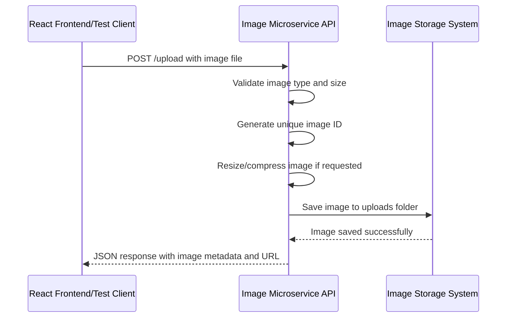

#### --demo react frontend App.js is in /demo-react folder

#### --put this in your own react frontend should show the demo

#### --Create image-microservice:

#### --Initialize Node.js project:

npm init -y

#### --Install the dependencies:

npm install express cors multer sharp uuid

#### --Create server.js file:

touch server.js

#### --install nodemon as a dev dependency:

npm install --save-dev nodemon

#### --upudate package.json:

"scripts": {
"start": "node server.js",
"dev": "nodemon server.js"
},

#### "npm start" to run the project

## Description

This microservice allows users to upload, retrieve, list, and delete images through HTTP requests. Uploaded images are stored in the uploads folder and image metadata is stored in memory.

## How to Request Data

### Upload an Image

Send a POST request to:

`/upload`

Optional query parameters:
- width
- height
- quality

The request must contain:
- an image file in the `image` form field

### Example JavaScript Request

```javascript
const formData = new FormData();
formData.append("image", fileInput.files[0]);

fetch("http://localhost:3002/upload?width=300&height=300", {
    method: "POST",
    body: formData
})
.then(response => response.json())
.then(data => console.log(data));
```

## How to Receive Data

The microservice returns JSON responses.

### Example Response

```json
{
    "success": true,
    "image": {
        "id": "12345",
        "filename": "12345.jpg",
        "url": "http://localhost:3002/images/12345.jpg"
    },
    "message": "Image uploaded successfully"
}
```

## UML Sequence Diagram


